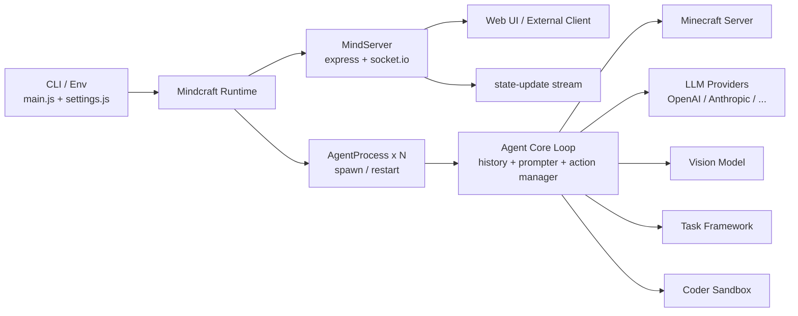
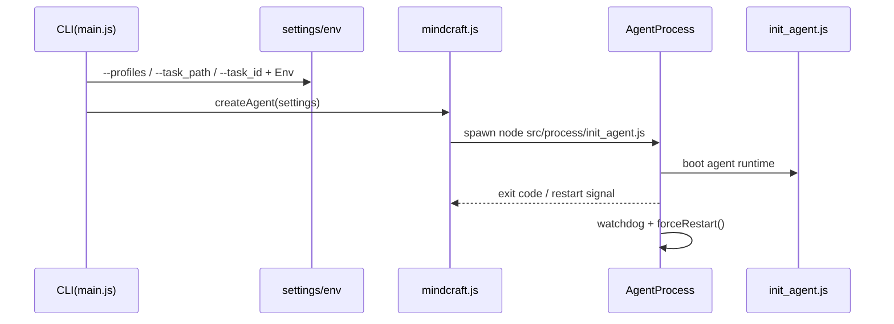
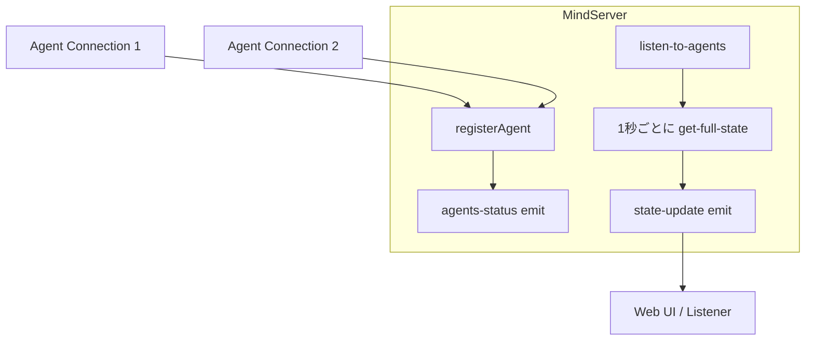
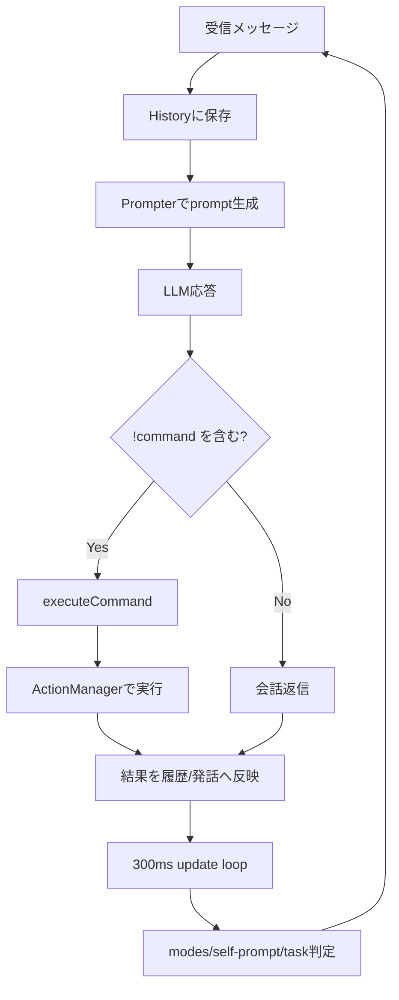
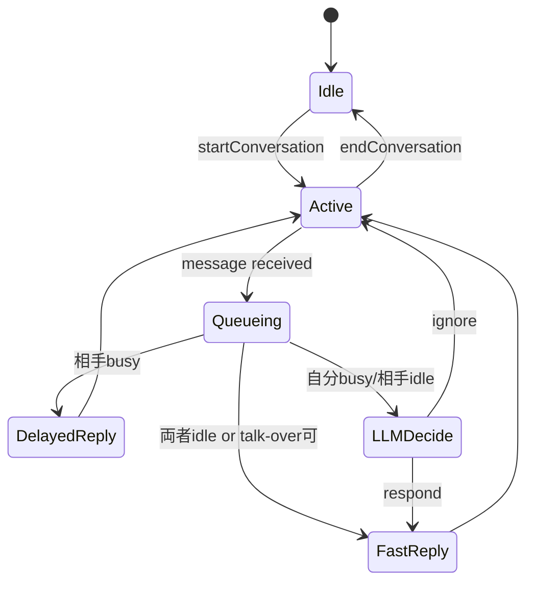
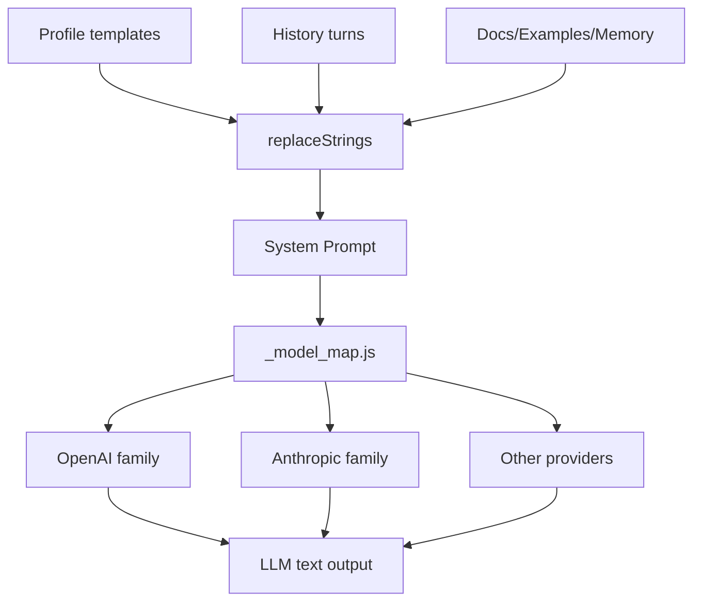
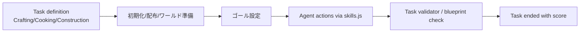
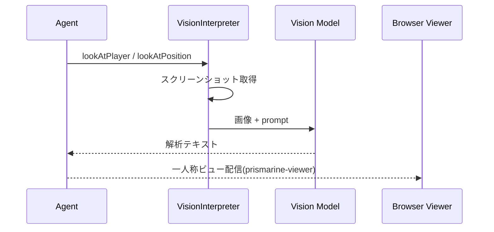
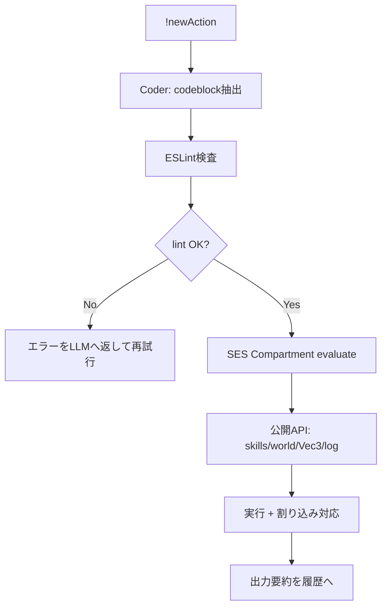

# Mindcraft コア機能まとめ（図解版）

このドキュメントは `docs/core-features.md` の内容を、Mermaid図で俯瞰しやすく再構成した版です。

## 全体アーキテクチャ



対応項目: 1, 2, 3, 4, 5, 11, 13, 14, 15

## 起動・設定・プロセス管理



対応項目: 1, 3, 4

## MindServer（制御ハブ + 状態配信）



対応項目: 2

## エージェント中核ループ



対応項目: 5, 7, 8, 10

## コマンドDSL実行パイプライン

```mermaid
flowchart LR
    R[LLM response] --> X[コマンド抽出<br/>!name(args)]
    X --> V[型・domain検証]
    V --> MAP[commandMap lookup<br/>actions + queries]
    MAP --> BL{blacklist対象?}
    BL -- Yes --> REJ[拒否/無効化]
    BL -- No --> RUN[perform実行]
    RUN --> RES[system結果文字列]
```

対応項目: 6

## マルチエージェント会話制御



対応項目: 9

## LLM層（抽象化・プロンプト組立）



対応項目: 11

## スキル・タスク・評価



対応項目: 12, 13

## 画像理解とビューア



対応項目: 14

## `!newAction` サンドボックス実行



対応項目: 15

## 設計意図（要約）

- 複数エージェント・複数タスク・複数モデルを同一基盤で運用できる構成。
- 自由度（LLM生成行動）と安全性（モード/割り込み/プロセス分離）を両立。
- 実験実行から評価（スコア）までを一連のワークフローとして提供。
